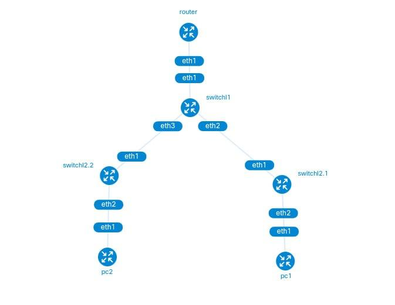
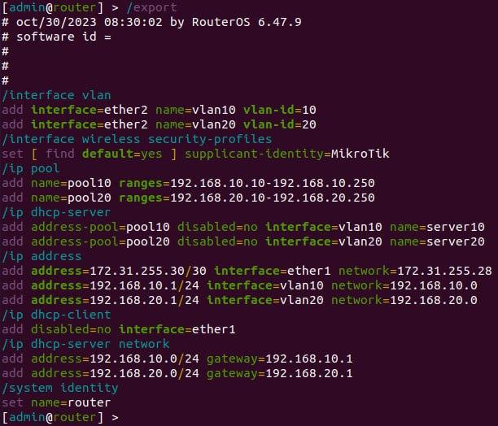
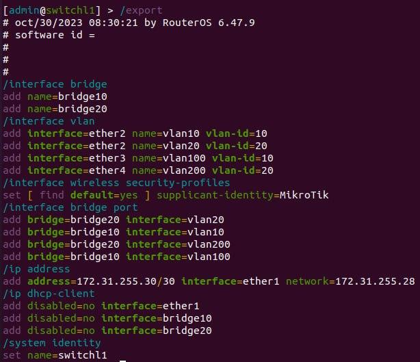
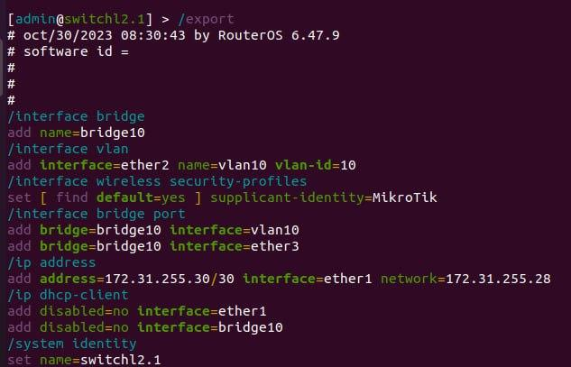
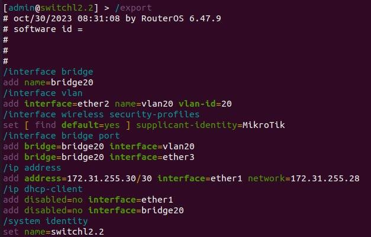
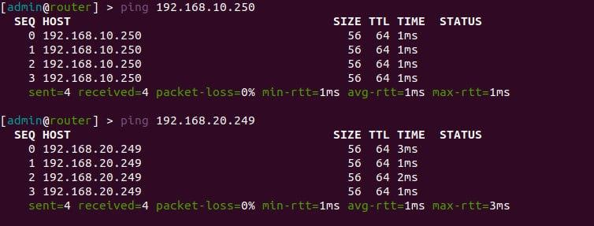
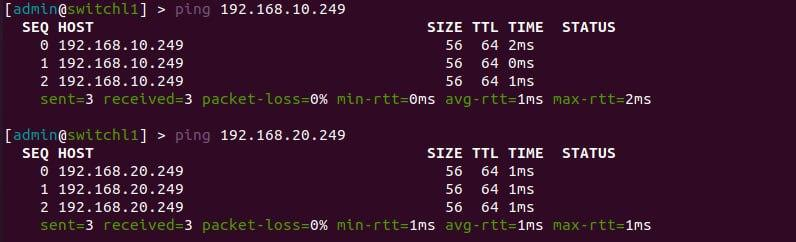

University: [ITMO University](https://itmo.ru/ru/)  
Faculty: [FICT](https://fict.itmo.ru)  
Course: [Introduction in routing](https://github.com/itmo-ict-faculty/introduction-in-routing)  
Year: 2023/2024  
Group: K33212  
Author: Ivakhnyuk Valeriy Sergeevich
Lab: Lab1  
Date of creation: 29.10.2023  
Date of finish: 30.10.2023  

## Лабораторная работ №1 "Установка ContainerLab и развертывание тестовой сети связи"

# Yaml файл с настройкой сети

Файл с топологией сети представлен на репозитории.

# Схема сети

# Настройка роутера

# Настройка switchl1

# Настройка switchl2.1

# Настройка switchl2.2

# Проверка сети

# Вывод

В результате выполнения лабораторной работы были получены навыки использования ContainerLab, а так же настройки и проверки vlan и ip адресации.
