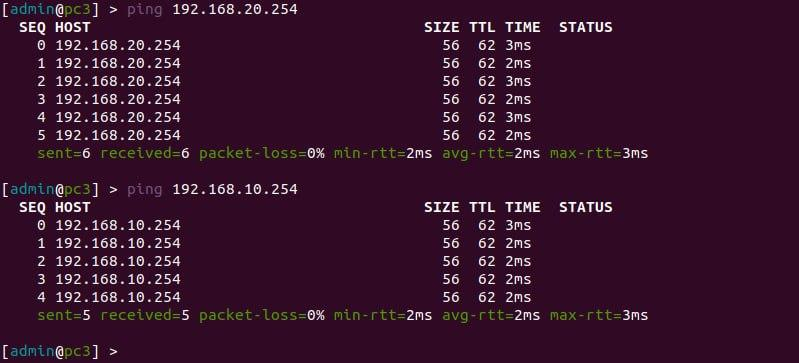

University: [ITMO University](https://itmo.ru/ru/)  
Faculty: [FICT](https://fict.itmo.ru)  
Course: [Introduction in routing](https://github.com/itmo-ict-faculty/introduction-in-routing)  
Year: 2023/2024  
Group: K33212  
Author: Ivakhnyuk Valeriy Sergeevich
Lab: Lab1  
Date of creation: 11.11.2023  
Date of finish: 13.11.2023  

## Лабораторная работ №2 "Эмуляция распределенной корпоративной сети связи, настройка статической маршрутизации между филиалами"

# Yaml файл с настройкой сети

Файл с топологией сети представлен на репозитории.

# Схема сети

# Настройка роутера FRT

# Настройка роутера MSK

# Настройка роутера BRL

# Настройка pc1

# Настройка pc2

# Настройка pc3

# Проверка сети

