University: [ITMO University](https://itmo.ru/ru/)  
Faculty: [FICT](https://fict.itmo.ru)  
Course: [Introduction in routing](https://github.com/itmo-ict-faculty/introduction-in-routing)  
Year: 2023/2024  
Group: K33212  
Author: Ivakhnyuk Valeriy Sergeevich
Lab: Lab3  
Date of creation: 26.11.2023  
Date of finish: 27.11.2023  

## Лабораторная работ №3 "Эмуляция распределенной корпоративной сети связи, настройка OSPF и MPLS, организация первого EoMPLS"

# Цель работы
Изучить протоколы OSPF и MPLS, механизмы организации EoMPLS.

# Ход работы
Настроить IP адреса на интерфейсах.
Настроить OSPF и MPLS.
Настроить EoMPLS.
Назначить адресацию на контейнеры, связанные между собой EoMPLS.

# Yaml файл с настройкой сети

Файл с топологией сети представлен на репозитории.

# Схема сети

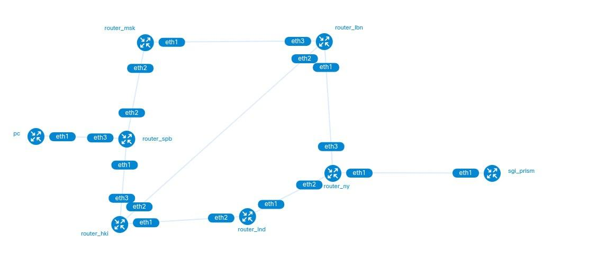

# Настройка SGI Prism

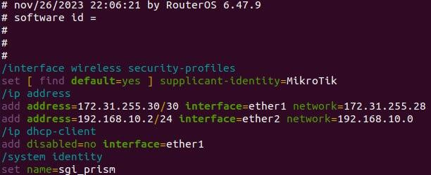

# Настройка PC

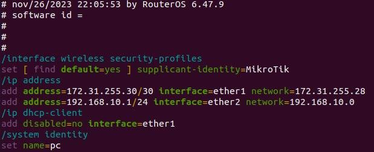

# Настройка роутера LBN

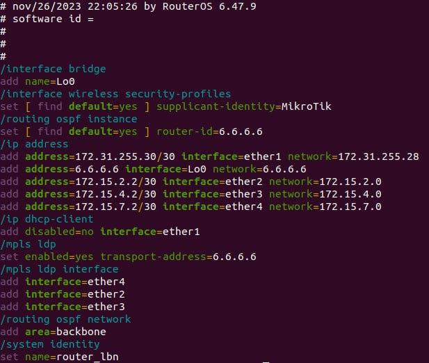

# Настройка роутера MSK

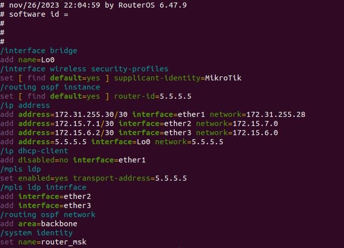

# Настройка роутера SPB

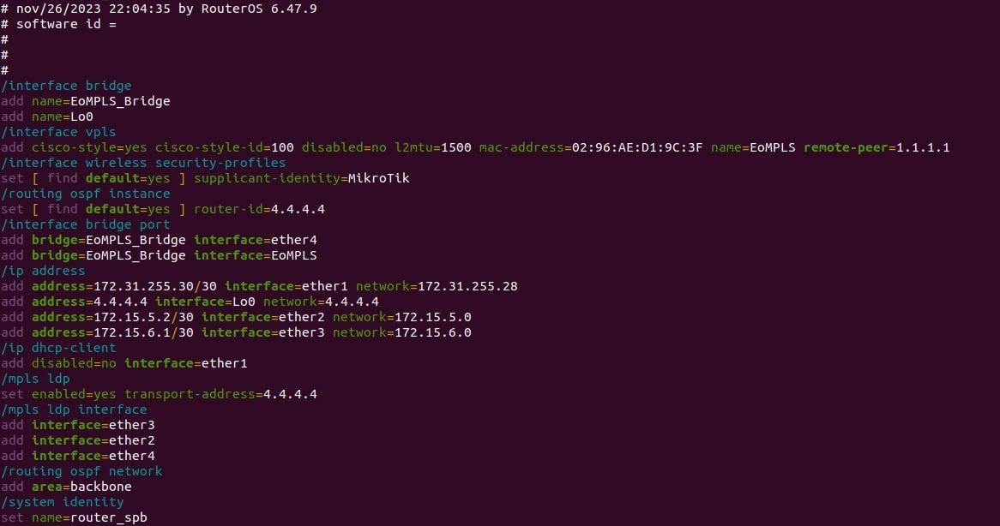

# Настройка роутера HKI

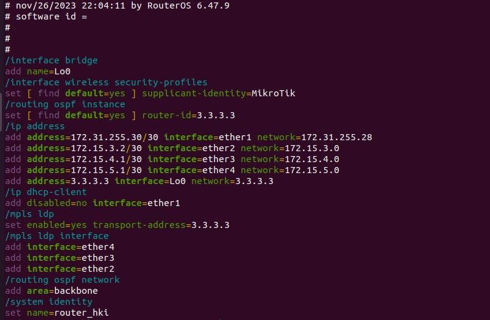

# Настройка роутера NY
Рассмотрим пошагово настройку OSPF и MLPS на примере роутера NY
1. Создаем интерфейсы EoMPLS_Bridge и Lo0
2. Конфигурируем VPLS на интерфейсе EoMPLS_Bridge, выставив параметры МАК адресса, максимальная единица передачи уровня 2 (L2MTU) и адрес конечной точки удаленного узла.
3. Изменяем профиль безопасности беспроводной сети по умолчанию для маршрутизатора, устанавливая идентификатор на «MikroTik», для безопасной беспроводной связи и аутентификации.
4. Настраиваем экземпляр маршрутизации OSPF с идентификатором маршрутизатора 1.1.1.1. 
5. Добавляем интерфейс ether2 к бриджу EoMPLS_Bridge.
6. Настраиваем ip адресса и клиент DHCP на необходимые интерфейсы
7. Включаем протокол распределения меток LDP для MLPS и указываем 1.1.1.1 как транспортный адрес.
8. Добавляем интерфейсы ether3 и ether4 к протоколу LDP, что позволяет этим интерфейсам учавствовать в процессах распределения меток.
9. Добавляем сеть к протоколу маршрутизации OSPF и назначает ее магистральной области.
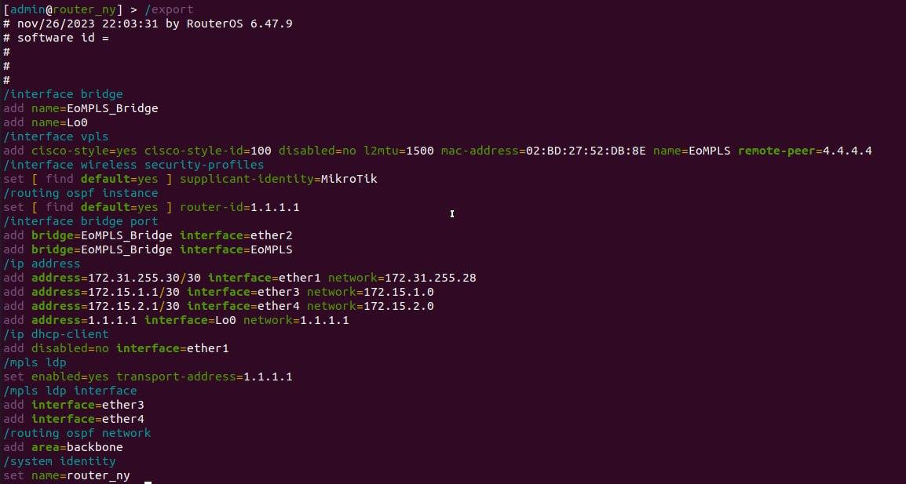

# Настройка роутера LBN

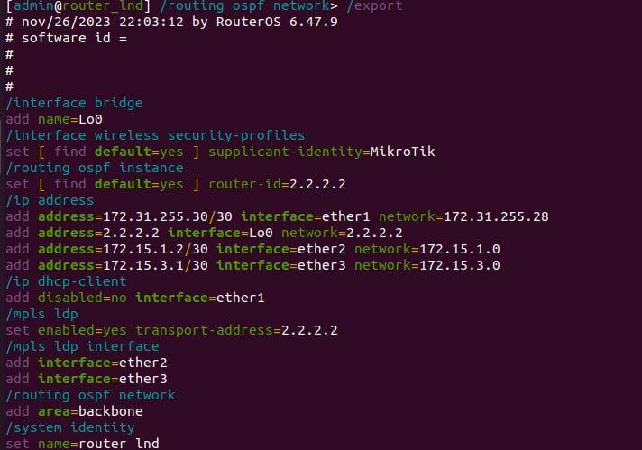

# Проверка сети

## Таблица маршрутизации роутера NY
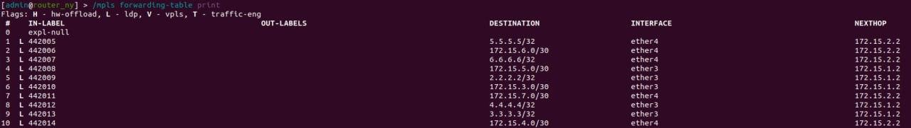

## Трассировка пакетов отправленных с роутера NY на роутер SPB
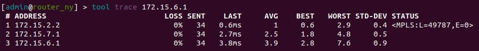

