University: [ITMO University](https://itmo.ru/ru/)  
Faculty: [FICT](https://fict.itmo.ru)  
Course: [Introduction in routing](https://github.com/itmo-ict-faculty/introduction-in-routing)  
Year: 2023/2024  
Group: K33212  
Author: Ivakhnyuk Valeriy Sergeevich
Lab: Lab3  
Date of creation: 26.11.2023  
Date of finish: 27.11.2023  

## Лабораторная работ №4 "Эмуляция распределенной корпоративной сети связи, настройка iBGP, организация L3VPN, VPLS"

# Цель работы
Изучить протоколы BGP, MPLS и правила организации L3VPN и VPLS.

# Ход работы
Вам необходимо сделать IP/MPLS сеть связи для "RogaIKopita Games" изображенную на рисунке 1 в ContainerLab. Необходимо создать все устройства указанные на схеме и соединения между ними.- Настроить OSPF и MPLS.
Помимо этого вам необходимо настроить IP адреса на интерфейсах.
Настроить OSPF и MPLS.
Настроить iBGP с route reflector кластером.
Первая часть:
Настроить iBGP RR Cluster.
Настроить VRF на 3 роутерах.
Настроить RD и RT на 3 роутерах.
Настроить IP адреса в VRF.
Проверить связность между VRF
Настроить имена устройств, сменить логины и пароли.
Вторая часть:
Разобрать VRF на 3 роутерах (или отвязать их от интерфейсов).
Настроить VPLS на 3 роутерах.
Настроить IP адресацию на PC1,2,3 в одной сети.
Проверить связность.

# Yaml файл с настройкой сети

Файл с топологией сети представлен на репозитории.

# Схема сети

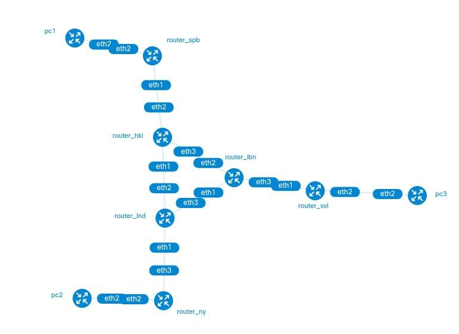

##Первая часть

# Настройка роутера router_ny

Рассмотрим настройку роутера для первой части задания на примере ny

1. Добавляем лупбек интерфейс Lo
2. Настраиванм экземпляр протокола пограничного шлюза (BGP) на маршрутизаторе. Выставляем идентификатор дефолтного роутера для маршрутизации в 1.1.1.1
3. Настраиваем экземпляр протокола OSPF, так же выставля идентификатор 1.1.1.1
4. Добавляем необходимые айпи адресса и DHCP протокол
5. Настраиваем маршруты в контексте VRF. Создаем маршрут на интерфейсе ether2, указывая метку маршрутизации и цели маршрута
6. Включаем MPLS на интерфейсе ether3
7. Настраиваем экземпляр протокола пограничного шлюза в контексте VRF с меткой VRF_DEVOPS
8. Настраиваем одноранговые узлы BGP для установления отношений соседства. Добавляем одноранговый узел BGP с указанными семействами адресов, удаленным адресом и источником обновлений.

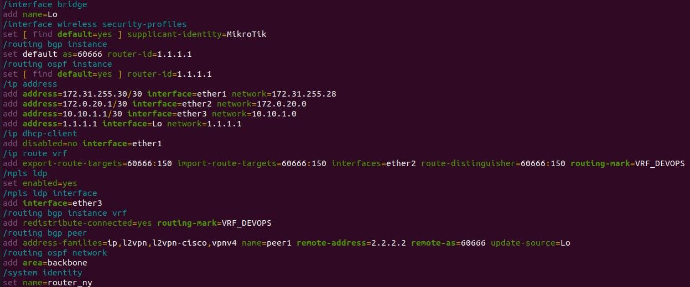

# Настройка роутера router_lnd

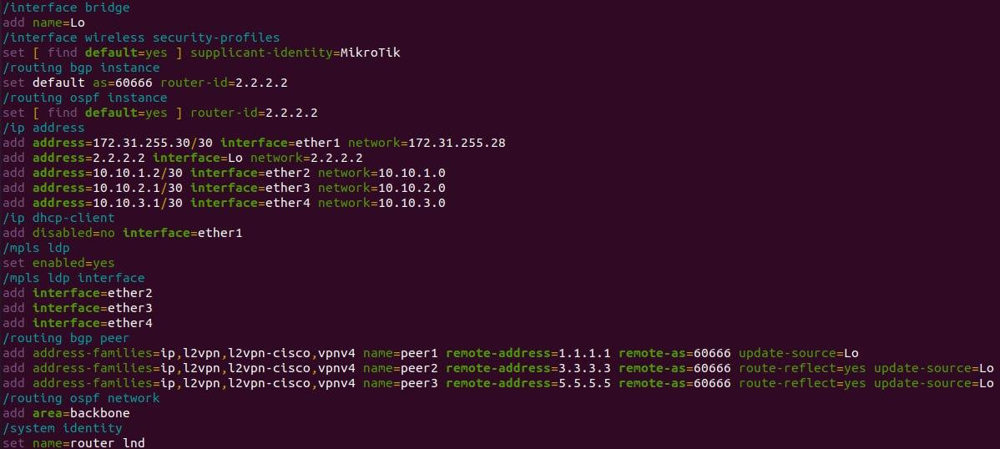

# Настройка роутера router_hki

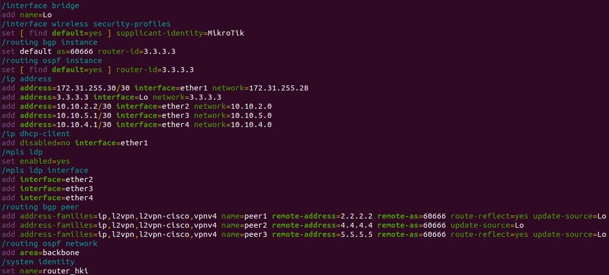

# Настройка роутера router_spb

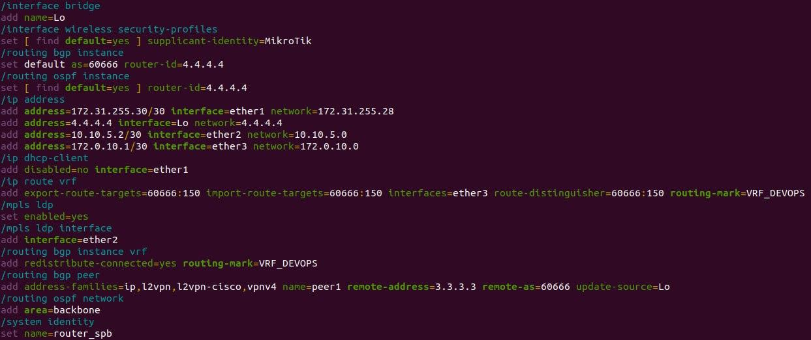

# Настройка роутера router_lbn

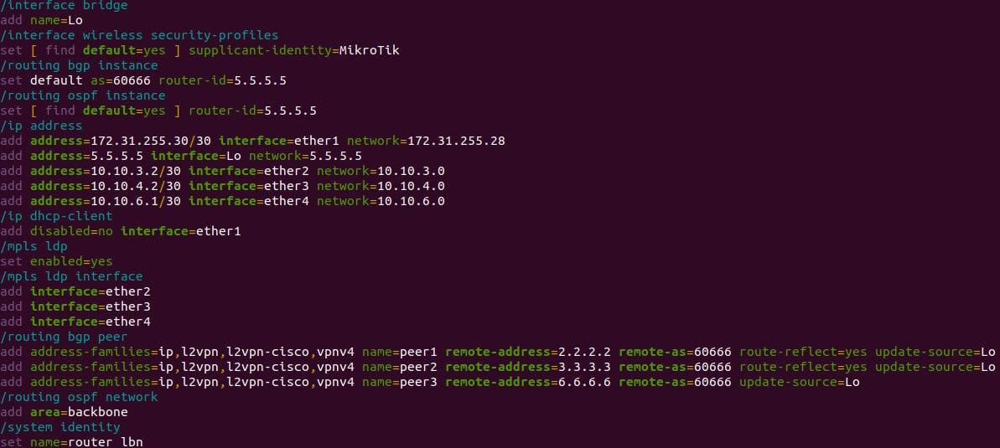

# Настройка роутера router_svl

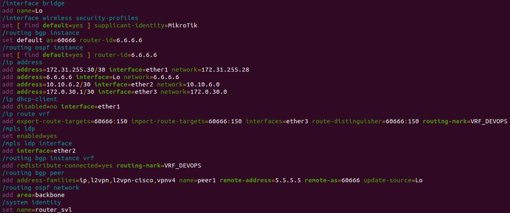

# Проверка связности

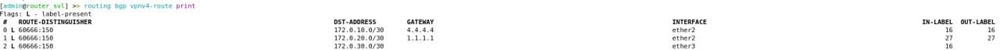

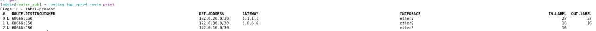

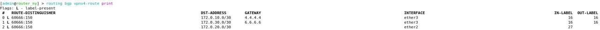

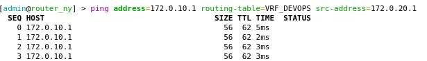

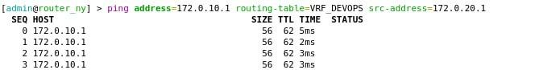

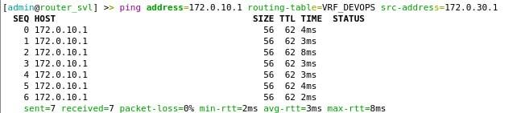

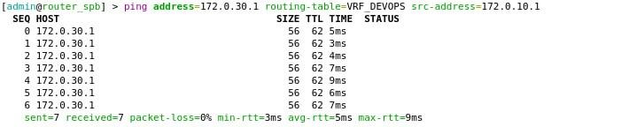

##Вторая часть

# Настройка PC3

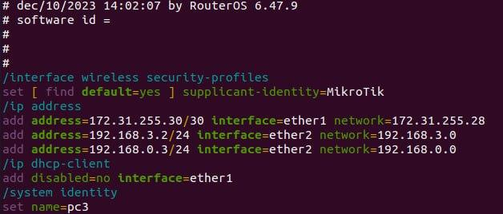

# Настройка PC2

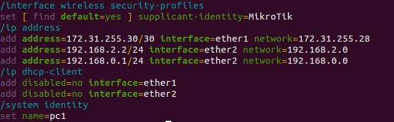

# Настройка PC1

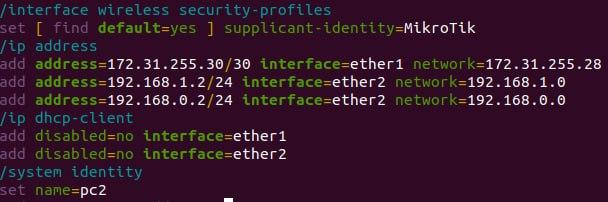

# Настройка роутера router_ny

Рассмотрим настройку роутера для второй части задания на примере ny
1. Для настройки VPLS надо добавить интерфейс моста.
2. Добавить интерфейс VPLS.
3. Настроить тунели указав МАК адрес, удаленный узел, айди сервиса, и максимальный размер единицы передачи для кадров уровня 2.
4. После чего добавляем экземпляры созданных тунелей в качестве порта участника оснвого моста. 

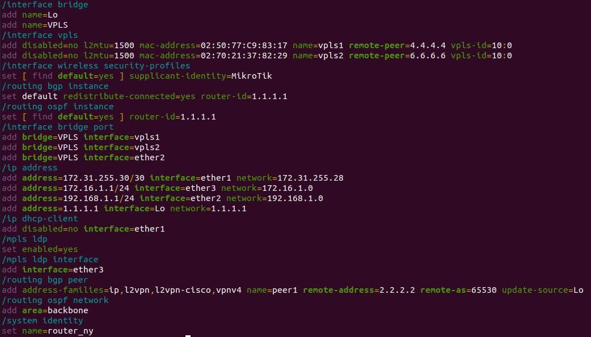

# Настройка роутера router_spb

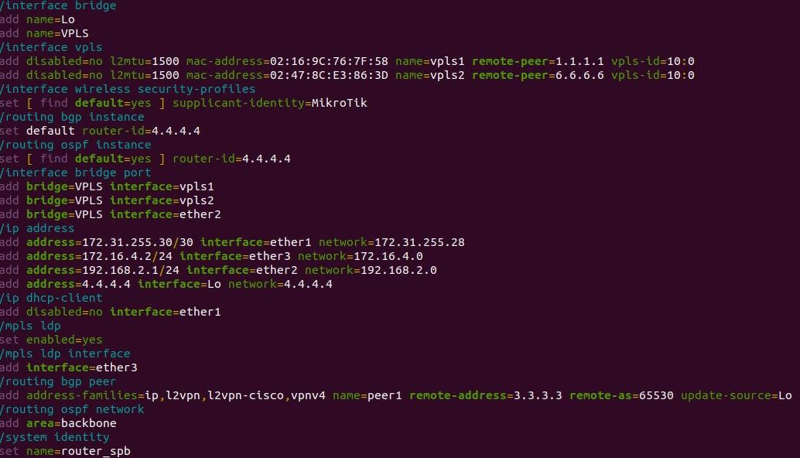

# Настройка роутера router_svl

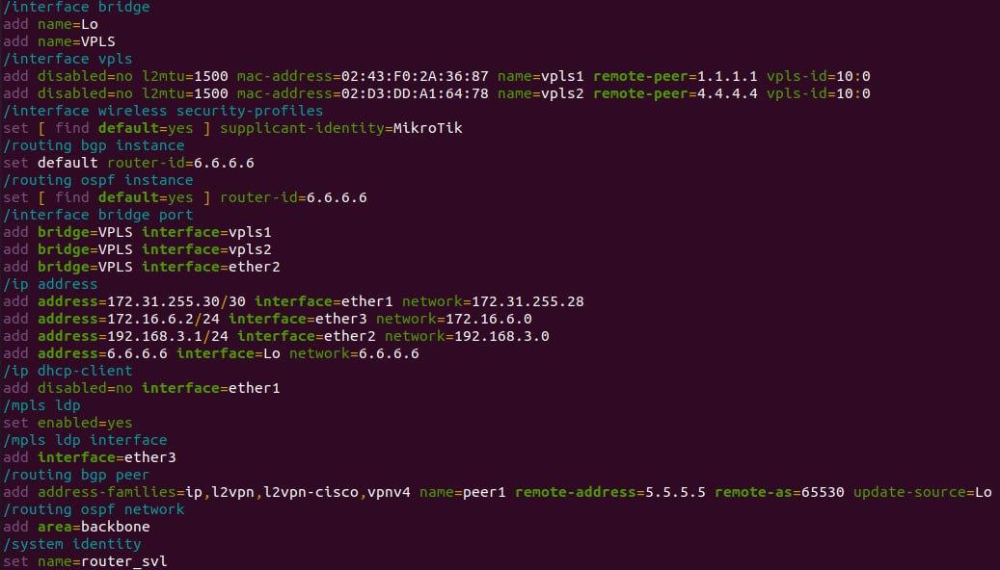

# Проверка связности pc

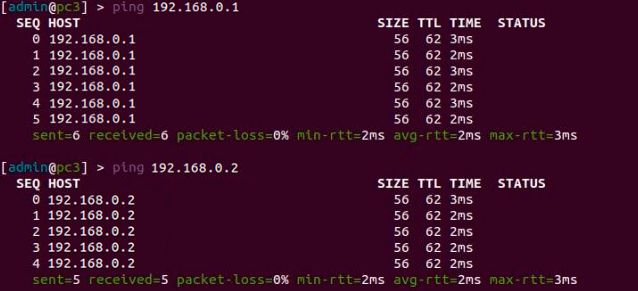

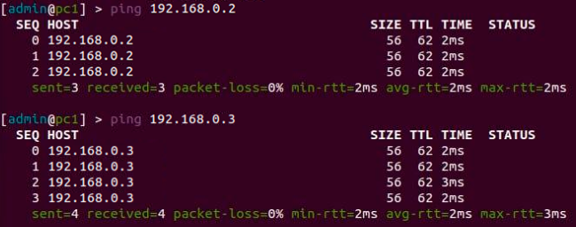

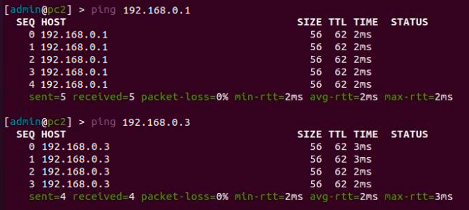

